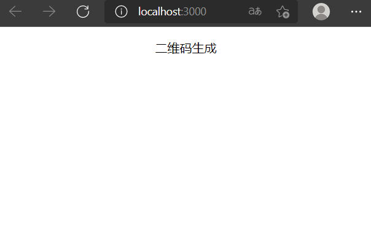
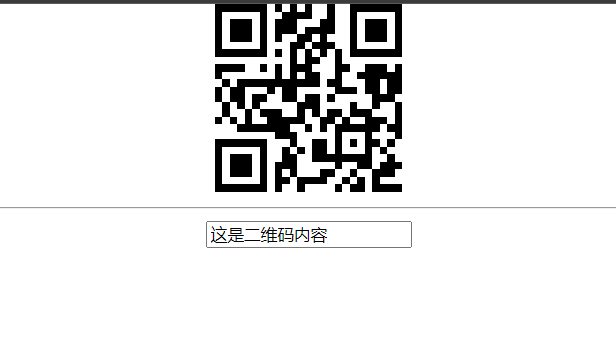

# 从零开始构建一个React二维码生成小工具

前几天看github trending 发现有一个项目[wifi-card](https://github.com/bndw/wifi-card) 很有趣，
输入wifi账号密码和加密方式，就能生成一个可以扫码连WIFI的二维码，而且二维码是实时刷新的，二维码内容随着输入实时变化。 这是个用React编写项目。用到了qrcode.react
这个包，我刚学自学React不久，就试着写一下，记录一下学习。 有一个已经写完的项目已经部署到线上了，地址是[qrcode](http://hellozwz.com:3000) 大家可以先看看大概实现了哪些功能。

## 实现功能

1. 文本内容生成二维码
2. WIFI生成二维码
3. 文件图片生成二维码

## 实现步骤

1. 快速构建一个react项目
2. 导入相关需要的包
3. 实现二维码生成的核心功能
4. 完善项目

### 1.快速构建React项目

①生成项目

````shell
npx create-react-app qrcode-generator
````

生成的项目大概如下内容：


②启动项目

````shell
npm start
````

启动后的界面:


经典的React Logo 这就说明项目启动成功了，但是我们并不需要这些，我们重新理一下项目结构 代码主要都在src目录下，结构如下：


主要代码：

pages/QrcodeGenerator.js:

我们的二维码就在这个页面编写，现在用文字代替

````js
import React from 'react';
import './qrcode-generator.css';

function QrcodeGenerator () {
    return (
        <div className={"container"}>
            <p>二维码生成</p>
        </div>
    );
}

export default QrcodeGenerator;
````

App.js

在App中导入QrcodeGenerator

````js
import React from 'react';
import QrcodeGenerator from "./pages/QrcodeGenerator";
function App() {
  return (
    <div>
      <QrcodeGenerator/>
    </div>
  );
}

export default App;
````

这样我们的界面就变为了简单的五个字：



这样第一步就完成了，接下来我们导入需要的包

### 2.导入相关需要的包

````shell
npm install qrcode.react
````

QrcodeGenerator 改为：

````js
function QrcodeGenerator() {
    return (
        <div className={"container"}>
            <QRCode
                value={"这是二维码"}
            />
        </div>
    );
}
````

这样的话二维码就出来：


但是这是静态的，接下来实现核心功能，根据内容动态生成二维码

### 实现二维码生成的核心功能

QrcodeGenerator 改为：

````js
function QrcodeGenerator() {
    const [value, setValue] = useState('');
    const handleInputChange = (e) => {
        const val = e.target.value;
        setValue(val);
    }
    return (
        <div className={"container"}>
            <QRCode
                value={value}
                size={150}
                renderAs="svg"
            />
            <hr/>
            <input value={value} onInput={handleInputChange}/>
        </div>
    );
}
````

这样的话，最核心的功能就实现了：



这里记录一下实现的代码，用了React Hooks来实现，我更喜欢这种纯Func的组件，用了 useState来管理状态，
然后来控制input输入框的value,让input的值可控，这样就是可控组件，input输入，就改变value， 
这个value也是 二维码的value,所以二维码就发生变化，这样就实现了核心功能，先记录到这里，完善项目之后再记录。


